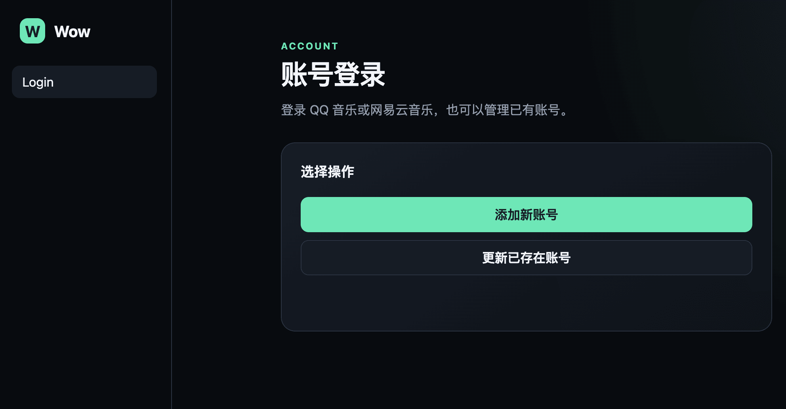
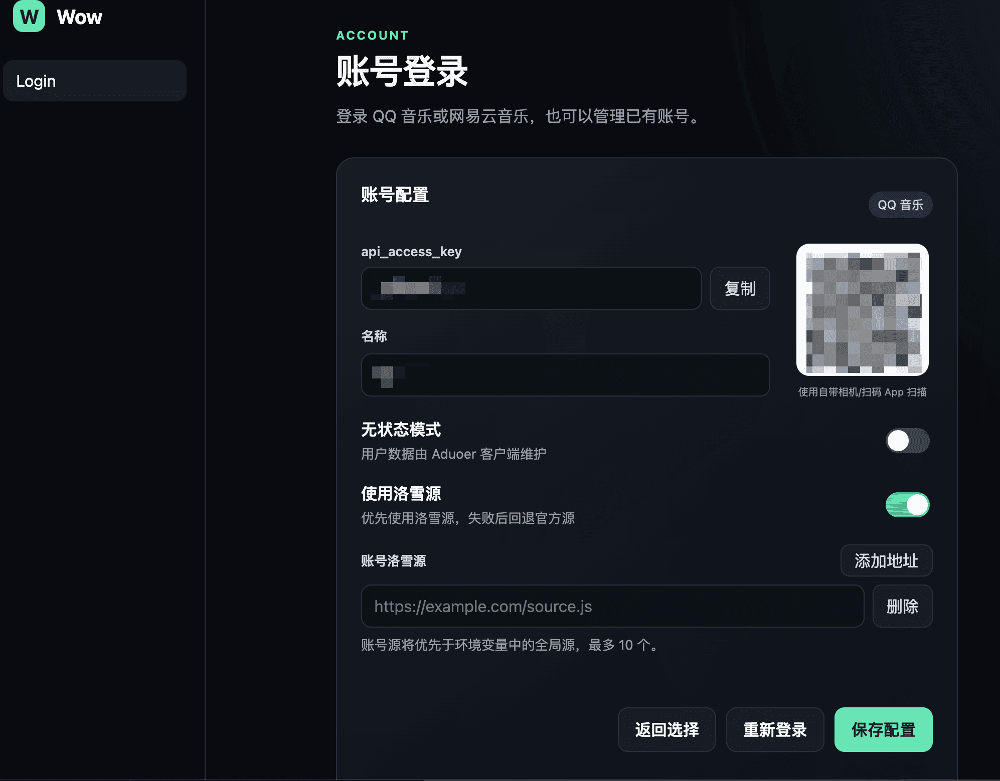

# Aduoer Wow Origin

面向 [Aduoer](https://github.com/Aduoer-Music) 的 QQ 音乐、网易云音乐统一 Wow v1 音源服务，支持搜索、歌单、榜单、歌曲、歌手、专辑、歌词和播放地址。

## 截图



## 部署

| 方式 | 适合场景 | 说明 |
| --- | --- | --- |
| Cloudflare Workers | 推荐，大多数用户 | 免费起步，无需服务器、Docker 或外部数据库 |
| Docker | 有服务器、Nas 用户 | 功能完整 |
| 桌面版 | 无服务器用户 | 开箱即用，自带运行环境 |
| QX、Loon 重写 | - | 仅提供基本能力，无落雪源 |

部署成功后，访问 `http://<your-server>:<port>/login` 配置账号

### Cloudflare Workers（推荐）

[](https://deploy.workers.cloudflare.com/?url=https://github.com/Anomi-oo/wow-origin)

点击按钮并授权即可部署。后续可在生成仓库的 **Actions → Sync upstream → Run workflow** 中手动同步上游，Cloudflare 会自动重新部署；同步不会修改 Cloudflare 环境变量和账号数据。

如需洛雪源，在部署页面的构建变量中设置：

```text
CF_LX_SOURCE_URL=https://example.com/source.js
```

Cloudflare 版只支持一个全局洛雪源。脚本会在构建时下载并编译进 Worker；更新源后需要重新部署

### Docker

```bash
mkdir -p data
docker run -d \
  --name aduoer-wow \
  -p 3000:3000 \
  --env-file .env \
  -v "$(pwd)/data:/app/data" \
  --restart unless-stopped \
  anomioo/wow-origin:latest
```

如果不需要环境变量，可去掉 `--env-file .env`。使用 Compose 时可直接下载配置和环境变量模板：

```bash
mkdir wow-origin && cd wow-origin
wget -O docker-compose.yml https://raw.githubusercontent.com/Anomi-oo/wow-origin/main/docker-compose.yml
wget -O .env https://raw.githubusercontent.com/Anomi-oo/wow-origin/main/docker.env.example
mkdir -p data
docker compose up -d
```

服务地址为 `http://localhost:3000`，账号管理页面为 `http://localhost:3000/login`，数据保存在 `data/`。

### 桌面版

从 [GitHub Releases](https://github.com/Anomi-oo/wow-origin/releases) 下载 Windows x64 安装包或 Apple Silicon macOS DMG。应用默认监听 `23231`，实际地址和 Aduoer 添加二维码会显示在首页。

关闭窗口后服务仍在托盘运行。macOS 若提示应用已损坏，将应用移入“应用程序”后执行：

```bash
xattr -d com.apple.quarantine /Applications/Wow.app
```

### Quantumult X / Loon 等重写方案

该版本通过请求重写直接提供 Wow SDK 和账号接口，不需要 HTTP Backend、BoxJS、Node.js 或服务器；不包含洛雪源、扫码登录及完整服务端能力。

- [一键导入 Quantumult X](https://quantumult.app/x/open-app/add-resource?remote-resource=%7B%22rewrite_remote%22%3A%5B%22https%3A%2F%2Fraw.githubusercontent.com%2FAnomi-oo%2Fwow-origin%2Fmain%2Frewrite%2Fresources%2Fwow-origin.quantumultx.snippet%2C%20tag%3DWow%20Origin%2C%20enabled%3Dtrue%22%5D%7D)
- [一键导入 Loon](loon://import?plugin=https%3A%2F%2Fraw.githubusercontent.com%2FAnomi-oo%2Fwow-origin%2Fmain%2Frewrite%2Fresources%2Fwow-origin.loon.plugin)

导入后启用 MitM，并安装、信任代理工具的证书。访问 QQ 音乐或网易云音乐触发 Cookie 捕获后，打开以下任一地址管理账号：

```text
https://pinhaoge.xyz
http://pinhaoge.xyz
```

Aduoer 中填写同一地址，并使用页面生成的 Token

## API

所有 Wow 接口位于 `/v1/*`。例如：

```bash
curl -H "Authorization: Bearer your_api_access_key" \
  "http://localhost:3000/v1/search/tracks?keywords=周杰伦&limit=20"
```

常用接口：

```text
GET /v1/status
GET /v1/search/tracks
GET /v1/playlist/detail
GET /v1/track
GET /v1/track/url
GET /v1/track/lyrics
```

播放音质支持 `max`、`min`、`standard`、`higher`、`exhigh` 和 `lossless`。开发环境可通过 `/openapi.json` 查看完整契约。

## 配置

| 变量 | 默认值 | 说明 |
| --- | --- | --- |
| `PORT` | `3000` | 服务端口 |
| `HOST` | `0.0.0.0` | 监听地址 |
| `LOG_LEVEL` | `info` | 日志级别 |
| `CORS_ALLOW_ORIGIN` | `*` | 允许访问的来源 |
| `LX_SOURCE_URL` | 空 | Node、Docker、桌面版的主洛雪源 |
| `LX_SOURCE_URL0`…`LX_SOURCE_URL9` | 空 | 备用洛雪源，按编号尝试 |
| `CF_LX_SOURCE_URL` | 空 | Cloudflare 构建时使用的全局洛雪源 |

洛雪源仅用于 `/v1/track/url`。自定义源会作为受信任代码运行，请勿配置未经审核的脚本。

## 开发

需要 Node.js 22 或更高版本。

```bash
npm ci
npm run dev
npm run typecheck
npm test
```

其他构建命令：

```bash
npm run cloudflare:typecheck
npm run cloudflare:deploy
npm run desktop:build
npm run rewrite:typecheck
```

Rewrite 的单文件页面位于 `rewrite/ui/index.html`，QuanX 和 Loon 配置位于 `rewrite/resources/`。

## 安全说明

- 不要公开 Cookie、数据库、`.env`、`api_access_key` 或私有洛雪源地址。
- Docker 构建不会包含本地 `data/` 和 `.env`。
- 若凭据曾进入公开仓库或日志，请立即刷新凭据并清理 Git 历史。

## 致谢

本项目基于 [Aduoer-Music/aduoer-wow-template](https://github.com/Aduoer-Music/aduoer-wow-template)，并参考了以下项目：

- [tlyanyu/multiPlatformMusicApi](https://github.com/tlyanyu/multiPlatformMusicApi)
- [neteasecloudmusicapienhanced/api-enhanced](https://github.com/neteasecloudmusicapienhanced/api-enhanced)
- [jsososo/QQMusicApi](https://github.com/jsososo/QQMusicApi)
- [lyswhut/lx-music-desktop](https://github.com/lyswhut/lx-music-desktop)

## 许可与免责声明

项目采用 [MIT License](LICENSE)，仅供学习与交流。使用者应遵守所在地法律、平台服务条款及内容版权要求，并自行承担使用后果。
